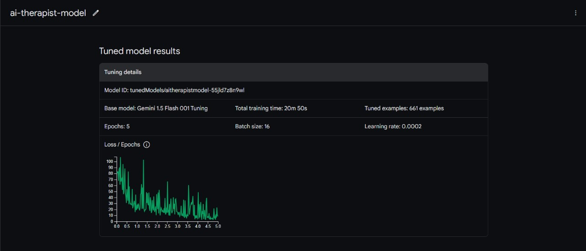
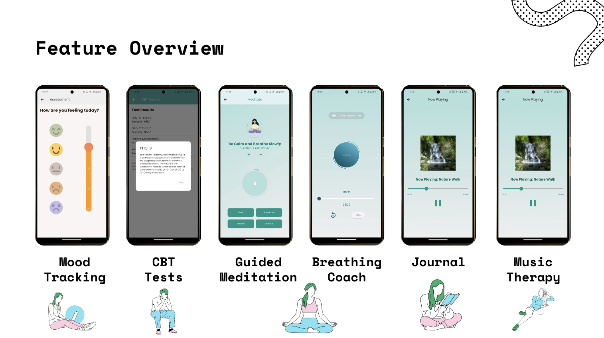
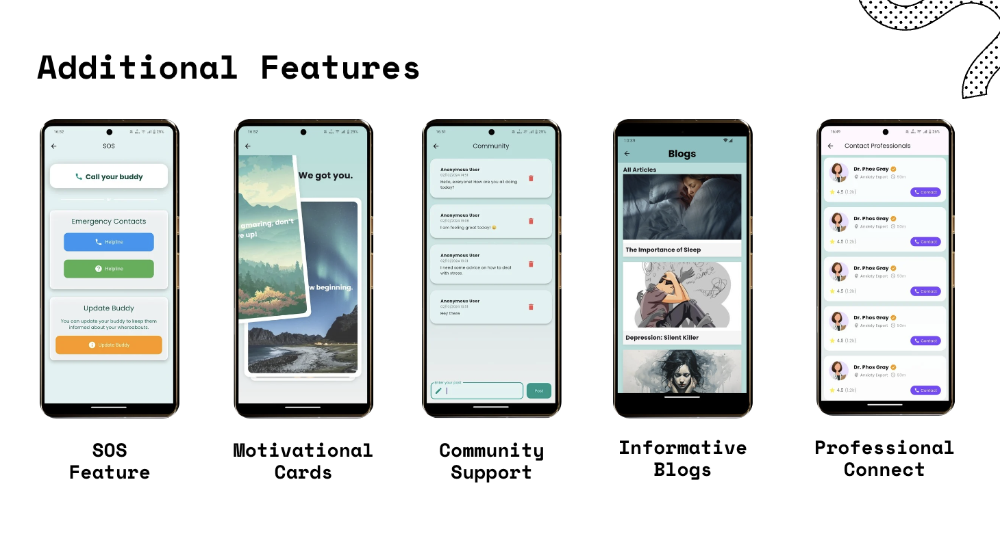
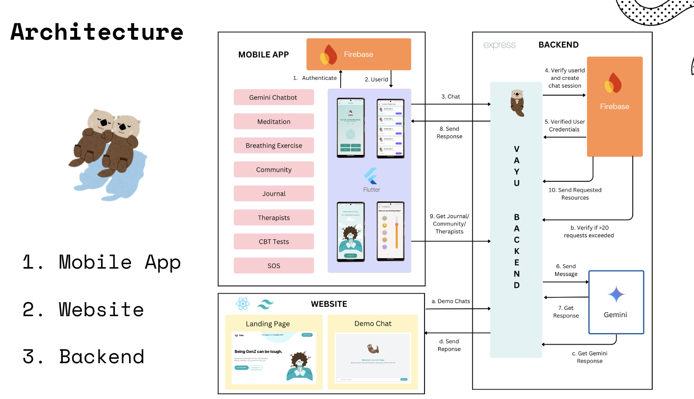
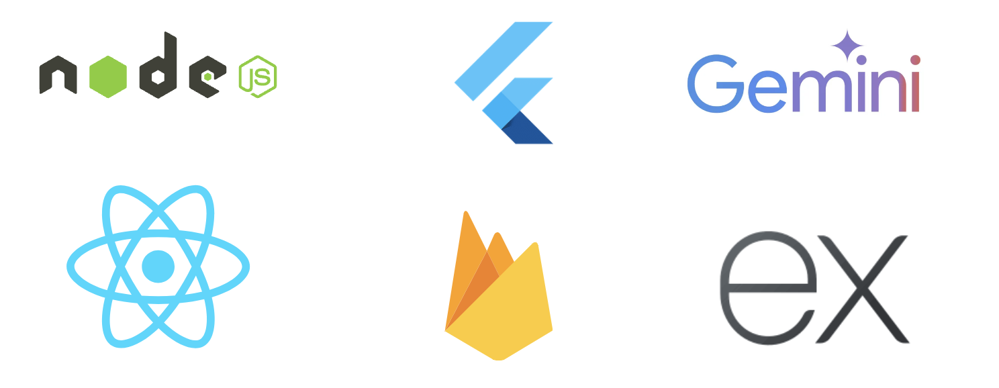

<!-- PROJECT TITLE -->
<div >
  <h1  style="bold"  >
    VAYU - GenZ way to mental health
  </h1>

  <br>


  
  <h3>
    Google GenAI 2024 Solution
  </h3>
  <hr>
</div>


<h2>Overview</h2>
Vayu AI therapist is designed to provide comprehensive mental health support through an accessible and user-friendly platform. It helps individuals address issues like depression, stress, and anxiety by offering a variety of tools and resources. Users can easily navigate the app through a secure authentication system and engage in activities such as journaling, meditation, and breathing exercises. The app also features a community where users can anonymously interact, share experiences, and support one another. Our goal is to create a supportive space where mental well-being can be managed and improved in a personalized and convenient manner.

<h2>Fine Tuned Gemini Model</h2>



<br>
<br>
<h2>What our project does for the same?</h2>

Our project combines essential mental health resources into one cohesive platform. After users log in, they can select from a range of mental health issues they are dealing with, such as depression or stress, and the app provides personalized tools to address these concerns. Users have access to various features like mood tracking, meditation, journaling, and breathing exercises, which help in self-care and mental health management. 

The app also offers a Cognitive Behavioral Therapy (CBT) test to assist users in assessing their mental health. Additionally, users can connect with mental health professionals and participate in an anonymous community forum, where they can share experiences and find encouragement from others.
<br>

<h2>Project Overview</h2>

### App Screenshots- 
<br>




### Architecture -  
<br>



<br>
<h2>Pepo in your Pocket 🦦</h2> 
<br/>
<video autoplay loop muted>
  <source src="readmeImages/Pepoo.mp4" type="video/mp4">
  Your browser does not support the video tag.
</video>

<h2>Key features</h2>

1. <b>Customizable Support:</b> Users can select specific issues like depression or stress to receive targeted mental health resources.

2. <b>Mood Chat with Pepo:</b> An interactive chat feature to help users track their moods and receive positive reinforcement.

3. <b>CBT Test:</b> A Cognitive Behavioral Therapy test to help users assess their mental health and identify negative thought patterns.

5. <b>Anonymous Community:</b> A supportive community forum where users can interact anonymously, providing a safe space for sharing and support.

4. <b>Motivational Cards:</b> Cards with motivational quotes and tips to uplift users during difficult times.

5. <b>Mental Health Blog:</b> A blog with articles and tips on managing stress, depression, and other mental health challenges.

<br>
<h2>Technologies used</h2>


</div>

<br>

<h2>How to Setup</h2>

Clone the repository using 

```
git clone <repository-url>
```

Install dependencies using 
```
cd landing
npm install
```
Install dependencies using 
```
cd backend
npm install
```
Install dependencies using 
```
cd app
flutter pub get
```

Start the Project
```
backend -> nodemon server.js
landing -> npm start
app -> flutter run
```


<h2>About us</h2>

### Team Members 

Final Year Students of Btech Computer Engineering - 

1. Nishant Dixit
2. Rachit Tandale
3. Om Bothre
4. Sahil Sasane

We have created Vayu with our own touch and preferences. Watching many of our close one's into depression is something which can bother any one. This project is close to us and also would be to you!

