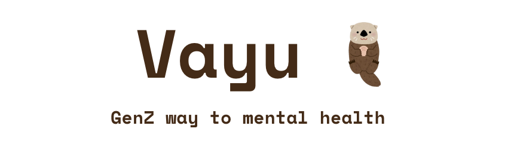

<!-- PROJECT TITLE -->
<div >
  <h1  style="bold"  >
    VAYU - GenZ way to mental health
  </h1>

  <br>


  
  <h3>
    Google GenAI 2024 Solution
  </h3>
  <hr>
</div>


<h2>Overview</h2>
Food waste and hunger are major global issues. Around one-third of food produced for human consumption is wasted annually, while an estimated 690 million people suffer from hunger daily. These problems are interlinked and require a comprehensive approach.

<h2>What our project does for the same?</h2>

Our project aims to address the issues of food waste and hunger by creating a platform that connects users with NGOs/Retreate centres that are dedicated to feeding the hungry and providing food to those in need. By facilitating these connections, we hope to contribute to the achievement of food security and minimize the problem of food wastage.

Our goals include providing reliable and sustainable food sources to those in need, reducing food waste by channeling it to those who can use it, and raising awareness and encouraging action on the issues of food waste and hunger.
<br>


<h2>Sustainable Development Goals</h2>

To contribute to the Sustainable Development Goals, Hunger Halt aligns with "Zero Hunger" and "Good heatlh and well being". By reducing food waste and ensuring surplus food reaches those in need, our project addresses the global challenge of hunger and promotes sustainable practices in food consumption.


<h2>Project Overview</h2>

### App Screenshots- 
<br>


### Architecture -  
<br>


<br>
Hunger Halt Video : https://youtu.be/EQqf-oyWLzk


<h2>Key features</h2>

1. A platform for NGOs/Retreate centres dedicated to feeding the hungry and reducing food waste to connect with users who are interested in supporting these causes.

2. A donation page for users to donate edible food or raw food to NGOs that they support.

3. A volunteer section where users can upload their convenient time slot and select a day for volunteering,

5. An easy-to-use interface that makes it easy for users to navigate the website.

4. Use of google maps will enable NGO's to track the providers efficiently.

<br>
<h2>Technologies used</h2>


</div>

<br>

<h2>How to Setup</h2>

Clone the repository using 

```
git clone <repository-url>
```

Install dependencies using 
```
cd frontend
npm install
```
Install dependencies using 
```
cd backend
npm install
```
Install dependencies using 
```
cd app
flutter pub get
```

Start the Project
```
backend -> nodemon server.js
frontend -> npm start
app -> flutter run
```


<h2>About us</h2>

### Team Members 

1. Nishant Dixit
2. Rachit Tandale
3. Om Bothre
4. Sahil Sasane

We have created Vayu with our own touch and preferences. Watching many of our close one's into depression is something which can bother any one. This project is close to us and also would be to you!

